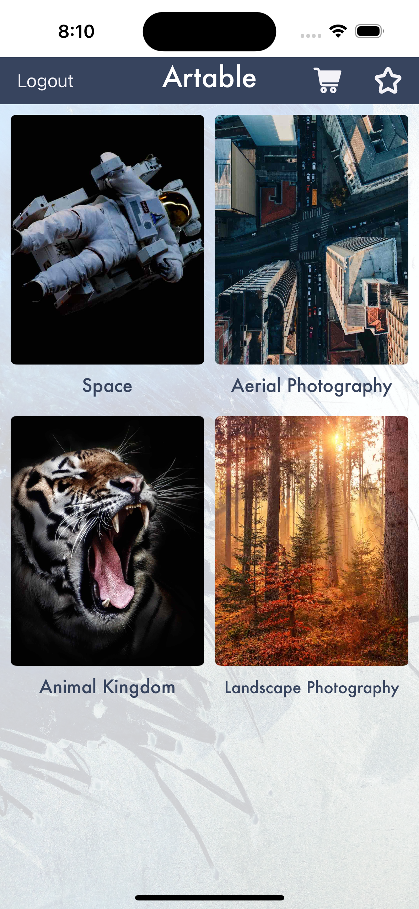

# Artable

**Artable** is a two-part app designed for users to browse and purchase artworks, while admins can manage categories and products via a separate admin interface. The app is built using Swift, UIKit, Firebase, and Kingfisher for image handling.

## Features

### Client App

- **Browse Categories**: Users can view art categorized into collections.
- **Add Products to Cart**: Select artworks and add them to the shopping cart.
- **Favorite Products**: Mark artworks as favorites for easy access.
- **Authentication**: Users can create accounts, log in, and continue as guests.

### Admin App

- **Category Management**: Admins can create, edit, and delete categories.
- **Product Management**: Admins can add, edit, and remove products.
- **Image Uploads**: Easily upload product and category images using Firebase Storage.

## Screenshots

### Client App

| Login Screen  | Register Screen  | Categories Screen  | Product Listing Screen  | Product Details Screen |
| ------------- | ---------------- | ------------------ | ---------------------- | ---------------------- |
|  |  |  |  |  |

### Admin App

| Category Management  | Add Category Screen  | Product Listing Screen | Add Product Screen |
| -------------------- | -------------------  | ---------------------  | ------------------ |
|  |  |  |  |

## Installation

To run this project locally:

1. Clone the repository:

   ```bash
   git clone https://github.com/anup810/Artable.git
   ```

2. Install required CocoaPods:

   ```bash
   cd Artable
   pod install
   ```

3. Open the project in Xcode:

   ```bash
   open Artable.xcworkspace
   ```

4. Configure Firebase:

Download your GoogleService-Info.plist from Firebase and add it to the project.

### Running the Client App

Select the Artable target in Xcode and run the app to launch the client-side interface.

Users can browse categories, add products to the cart, and manage their favorites.

### Running the Admin App

Select the ArtableAdmin target in Xcode and run the app to launch the admin interface.

Admins can add/edit categories and products. Admin actions include uploading product/category images and saving changes in Firestore.

## Project Structure

- **Artable/**: Contains the main source code for the client application.
- **ArtableAdmin/**: Contains the main source code for the admin application.
- **HomeVC.swift**: Displays categories of artworks.
- **ProductVC.swift**: Manages the display of products within a category.
- **AdminProductVC.swift**: Handles admin-side product management.
- **UserService.swift**: Manages user data, including favorites, authentication, and user state.
- **Product.swift**: Defines the data structure for products.
- **Category.swift**: Defines the data structure for categories.
- **Assets.xcassets**: Contains all images and sound assets used in the app.
- **Constants.swift**: Stores constant values used throughout the app.

## Dependencies

- **Firebase Authentication**: Manages user registration, login, and guest sessions.
- **Firebase Firestore**: Stores all product, category, and user data.
- **Firebase Storage**: Handles image uploads.
- **Kingfisher**: For efficient image loading and caching.
- **CocoaPods**: Dependency manager used to manage external libraries.

## Contributing

Contributions are welcome! If you find a bug or want to add a feature, feel free to submit a pull request.

1. Fork the repository.
2. Create a new branch:

   ```bash
   git checkout -b feature/your-feature-name
   ```

3. Make your changes and commit them:

   ```bash
   git commit -m "Add your feature"
   ```

4. Push to the branch:

   ```bash
   git push origin feature/your-feature-name
   ```

5. Open a pull request.

## GitHub Repository

[Artable GitHub Repository](https://github.com/anup810/Artable)
